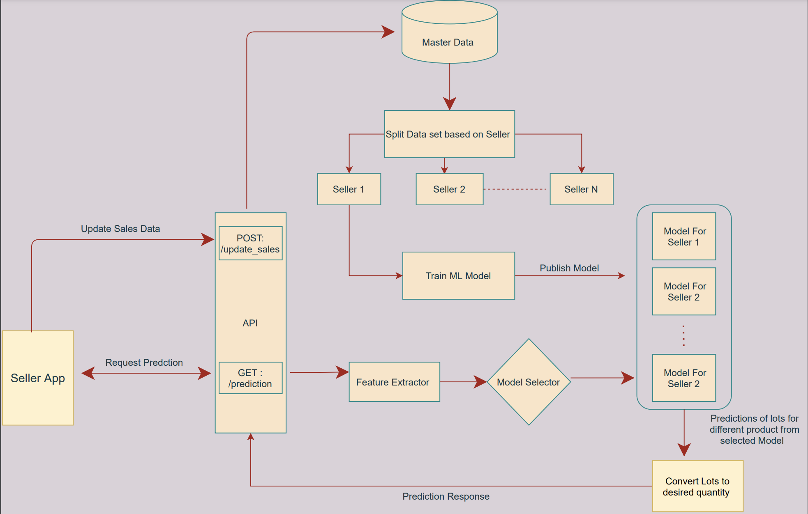

# ONDC Invovation Hackathon  

## Team Name

**Homies**

## Team members

- Ashish Bhalgat (ashish.bhalgat@thoughtworks.com)
- Md Faisal Sohail (mdfaisal.sohail@thoughtworks.com)
- Md Mubasir (md.mubasir@thoughtworks.com)
- Naresh Chakali (chakali.naresh@thoughtworks.com)
- Nilesh Mahadik (nilesh.mahadik@thoughtworks.com)

## Problem Statement :
__Challenge 6__ : *Create a model (using formal programming language) for non-deterministic inventory
    management to determine the optimal “lot size” to minimize the operational costs related to
    ordering and moving goods through the retail supply chain.*
    
We understood the problem of local Kirana store in managing the inventory. The major challenges the Kirana seller has,
    
- __Optimal Lot Size__ - Optimal lot size of a given product for future month.
- __Efficiently manage inventory space__ - Right lot size to ensure the inventory space is efficiently managed for multiple products.
- __Predict products in demand__ - Identify what products will be in demand for upcoming month and their optimal quantity.
- __Predict unforeseen crisis__ - Identify any unforeseen instances (Economy crisis, Health crisis , Weather crisis , Regional news sentiment) which might impact future demand and plan accordingly.
- __Maximize profit__ - Seller wants to make maximum profit from his investment made in inventory.    

## Approach :

The team came up with generic , re-usable , scalable Machine Learning model which can help seller address above challenges.

The seller can trained their specific model with their sales data for last few years and model will be able to predict optimum lot size for next few months. 

The ML model will be customized , trained and deployed separately for each seller to improve the accuracy based out of seller historical data , demand , weather , economic , regional sentiments.

The ML model will pre-process the data and extract weighted features as part of pre processing step. The model will further consider all the external factors like weather , economy , regional sentiments , population and festival timeframe through calender. 

The ML model with deployed on Azure Cloud and will be exposed via API endpoint for prediction and re-trained the model.

### Assumptions :

- The data set used for building the model is mocked data for an a year(2020) time frame.
- The external data used for the model training is coming from seed data instead of integration with real service.
- The data set represent sales of a given 10 products for each month in that store for a year.
- The lot size taken in train data is 100 units(kg/pieces) for all products
- The features used in prediction model e.g. weather data, economy status, health crisis data, population density etc. are currently being read from seed files. The data provider implementations should further be extended to read these feature data from realtime online sources. Example weather data : https://openweathermap.org/api
- The prototype seed data contains below values for now,
  store ids - mum-str-01
  
  

### ML Model :

A non-deterministic ML model which predicts optimal quantity of products for a seller . The model is built on Random forest algorithm.

- __Key-Hightlights__ :
    - Customized prediction for each seller on platform 
    - Ability to extract required feature  
    - Auto-retrain mechanism  over a period of time with live data
      
      

      
### Flow Diagram :

### Technical Detail : 

#### Tech Stack :
    
  **Language and Packages:**
  - Python
  - Panda
  - Sklearn
            
  **Tools and IDE:**
  - Jupyter Notebook
  - VS Code
  - Postman
            
  **Deployment :**
  - FastApi
  - Azure 
            
  **Algorithm :**
  - Random Forest 
            
### API documentation ###

The swagger API documentation has been implemented.
(http://ondchomiestw.eastus.cloudapp.azure.com:3000/docs)

    
   
### Reusability : 

- The model once prepared can be re-trained for each seller for their respective store lot size prediction and forecasting.
- The same trained model can be re-use by nearby kirana stores for forecasting demand.  
- The model can be tweaked so that it can be applied to another domain instead of retail. The team went ahead and were able to applied the model to Logistic domain.

    
### Scalability : 

- Currently the model is deployed in Azure IAAS given the timeframe and the usage. 
- The plan is to deploy the model in Azure / AWS Kubernetes cluster which can auto-scale based on demand.
- The mode training can be done on cloud based GPU cluster.
    
### Extensibility: 

- The model can be further extend to predict the products to be purchased and in demand for the seller. This will help seller to invest in right products , right quantity at right time.
- The model can be trained for huge set of data to improve the accuracy of the hypothesis claimed.
- The model can be applied in multiple domain where forecasting prediction is primary requirement. We could apply model in Retail as well as logistics domain. This can be further applied in Energy utlization , Distributors etc. 
    

### Instructions to build & operate the app: 

- **Initial setup**
    1. clone project repository :
         `git clone <path_of_github_repository>`
    2. Move to project directory
        `cd <path_of_clone_project_directory>`
        
- **Setup local environment**
    1. Create Virtual environment for python :
        `python3 -m venv venv`
    2. Activate virtual environment created :
        `source venv/bin/activate`
    3. Install pipenv :
        `pip3 install pipenv`    
    4. Install the requirements from pip file :
        `pipenv install`
    5. Start app locally :
        `uvicorn main:app --reload`

    
### Future Scope : 
- We can extend existing logic to predict optimal quantity of lots size of products of newly on-boarded seller based on existing model of seller residing at same place .
- Logic can be extended to support custom duration [ not necessarily a month starting from 1st, i.e : predictions from 03/02/2022 to 08/04/2022 ] for which a seller wants to stock products.
- Based on data collected from seller app via our post end point , ML model can be trained to suggest products to sell in an area , to maximize seller's profit .
- Given data of logistic company providing service in an area , we can provide suggestion of charges of different logistic company to enable seller to provide home delivery with maximum profit. - NB: Required factors : Weight ,date , distance ; factors which can be derived with our feature extractor : weather ( from date ) , holidays ( from date ) , population density ( from city ) etc.
- Scheduler can be incorporated to re-retrain model with live data to improve model accuracy over time.
      
   
   
### Revenue Model :    
- Seller will use the Software as service in subscription mode. 
- Seller will pay yearly subscription which will include below benefits,
    - Auto ee-training of model.
    - Get prediction of the product quantity for future month.
    - Alerting on demand of given product for the calender month.
    - Better pricing strategy.

